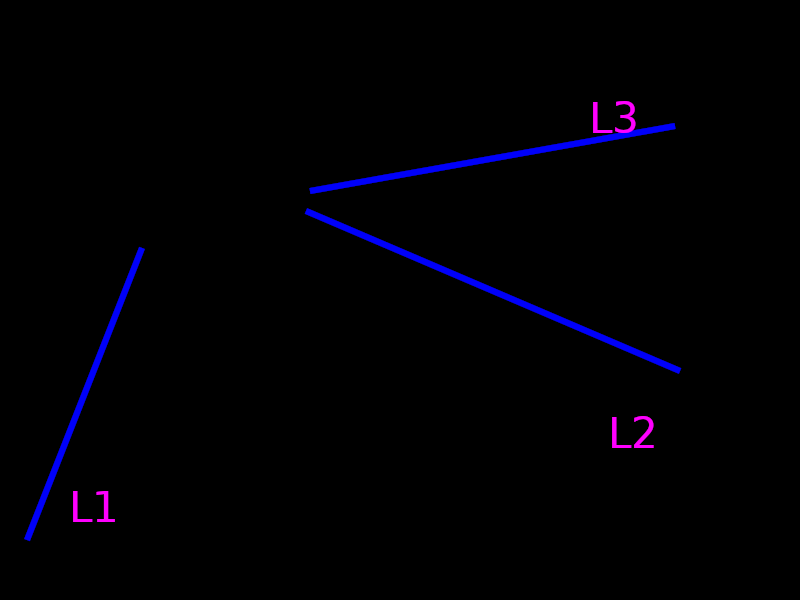
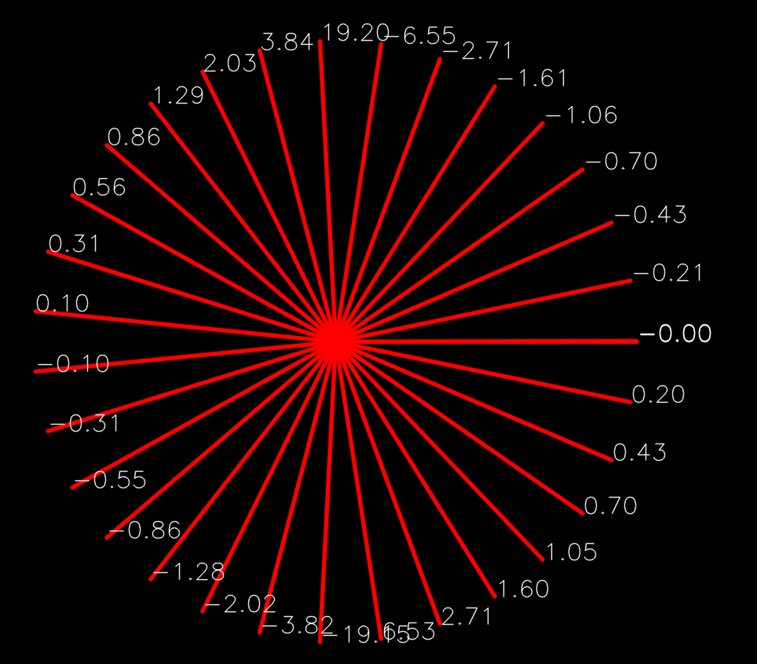

# Questões de ROS e OpenCV

Um dos objetivos de aprendizagem desta disciplina é desenvolver a habilidade de solucionar problemas de Robótica e Visão Computacional usando ROS e OpenCV para Python.

Uma lista não exaustiva do ferramental a ser utilizado inclui:
- Detecção e segmentação de objetos em imagens a partir de suas cores
- Detecção e segmentação de objetos em imagens usando Deep Learning
- Detecção de retas e círcunferências em  imagens
- Medição de distâncias entre o robô objetos no cenário usando o lidar
- Determinação da distância percorrida pelo robô através da odometria
- Determinação da posição aproximada do robô através da odometria  ([ver exemplo](../ros/exemplos_221/src/scripts/print_odom.py))
- Determinação da correta orientação do robô usando a IMU ([ver exemplo](../ros/exemplos_221/src/scripts/le_imu.py))
- Capacidade de guiar o robô seguindo pistas e evitando paredes usando Visão e lidar

## Exemplo de questão: Visão Computacional

#### O que é para fazer

Um código que plota **na tela** sobre a imagem dois pontos de fuga entre as retas:
- Em verde, mostre o ponto de fuga entre L1 e L2.
- Em vermelho, mostre o ponto de fuga entre L2 e L3.

Para diferenciar as retas, use o coeficiente angular das mesmas. Dica:

#### Orientações

O código base para este exercício está em `q1/q1.py`. Trabalhe na função `pontos_fuga()`. Este exercício **não precisa** de ROS.

|Resultado| Conceito| 
|---|---|
| Não executa | 0 |
| Encontra as retas e mostra na tela | 1.0 |
| Encontra um ponto de fuga corretamente | 1.8 |
| Encontra ambos os pontos de fuga | 2.5 | 

## Exemplo de questão: ROS

Enunciado:

[https://github.com/Insper/r2019_delta/blob/master/enunciado.md](https://github.com/Insper/r2019_delta/blob/master/enunciado.md)

## Vídeo com desenvolvimento das soluções

[https://web.microsoftstream.com/video/2f7b8fec-add8-4300-b902-2daf40fd4676?list=studio](https://web.microsoftstream.com/video/2f7b8fec-add8-4300-b902-2daf40fd4676)

Crie um projeto chamado de `aula05_q2` e trabalhe no arquivo `q2.py`. Faça um programa em ROS que realize as seguintes tarefas:

* Sorteia um ângulo $\alpha$

* Gira o robô uma magnitude $\alpha$ no sentido horário

* Faz o robô comećar a andar em frente (em suas coordenadas locais)

* Usa a odometria (tópico `\odom`) para deixar o robô imóvel depois que este andou $1.33m$ em relaćão a sua posićào inicial

#### Sugestão

No caso de trabalhar no simulador, recomenda-se o uso do *empty world*

        roslaunch turtlebot3_gazebo empty_world.launch

|Resultado| Conceito| 
|---|---|
| Não executa | 0 |
| Gira alpha no sentido certo | 1.0 |
|  Recebe odometria | 1.5 |
| Para após andar | 2.5 | 

