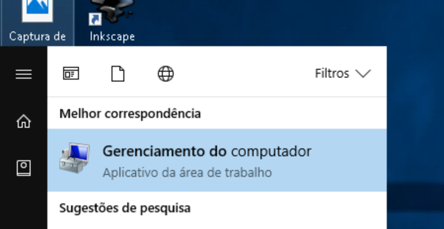
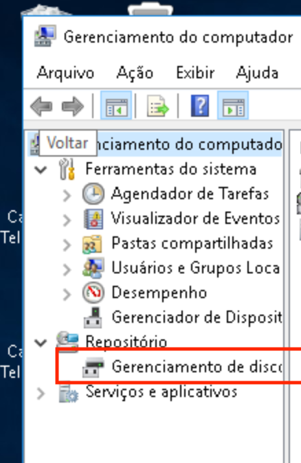
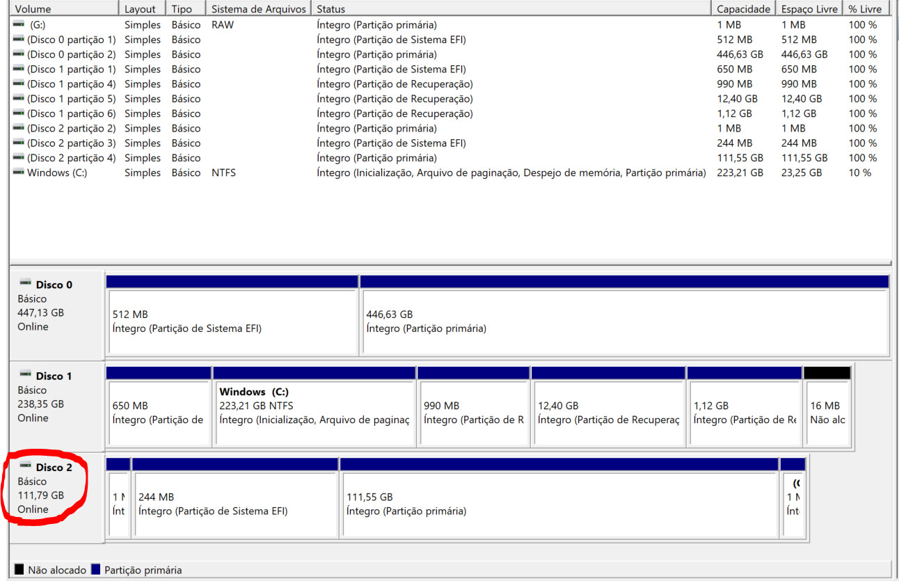
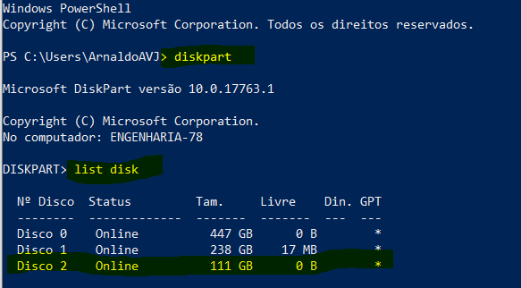
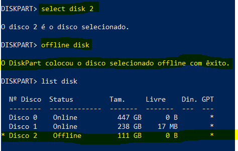
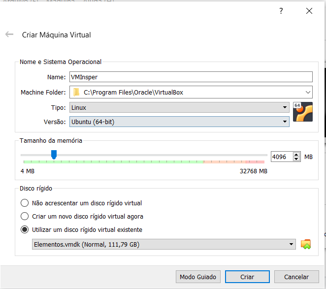

# Boot SSD via VirtualBox
## ETAPA 1
Através deste guia, você conseguirá criar uma máquina virtual no VirtualBox que realiza o boot do SSD disponibilizado para os alunos do terceiro semestre de Engenharia de Computação do Inpser.

Roteiro feito e testado no Windows 10 (mas com o devido cuidado funciona no MacOS e Linux também).

Antes de começar, verifique se há algum pendrive conectado, **se sim, ejete**.

Conecte o SSD (HD Externo) na USB do PC, neste momento deverá aparecer uma mensagem dizendo para formatar a unidade para poder utiliza-la, clique em **Não**.

Agora, abra o *Painel de Controle*, procure por *Ferramentas Administrativas* e em seguida *Gerenciamento do Computador* (Cuidado para não confundir com Gerenciador de Dispositivos!).

Agora no menu lateral, procure por **Gerenciamento de Discos**, na parte central, você deve ser capaz de ver o seu HD interno e o SSD conectado, caso contrário, verifique a conexão USB e certifique-se que clicou no botão Ignorar ao conecta-lo.

Procure pelo número do Disco referente ao SSD, geralmente fica na parte inferior em baixo do nome, no gráfico de barras. Deve haver algo como *Disco 2* ou *Disco 1*.

Agora, abra o Comand **cmd** como *Administrador* (botão direito, e executar como Administrador).
Navegue até a pasta do VirtualBox em:
    
    C:\Program Files\Oracle\VirtualBox 
    
Execute o comando abaixo, substituindo o *N* no final do comando *\PhysicalDrive**N** pelo número de disco corresponde visto anteriormente *Disco 2* ou *Disco 1*. Este comando irá criar um disco virtual, que na realidade não armazena dados e sim diz ao VirtualBox para procurar pelo SSD.
    
    VBoxManage internalcommands createrawvmdk -filename VMInsper.vmdk -rawdisk \\.\PhysicalDriveN

Se tudo ocorrer bem, deve aparecer a mensagem *RAW host disk access VMDK file VMInsper.vmdk created successfully*. Caso sim, continue, caso contrário, verifique o comando digitado.
 
 
 ## ETAPA 2
 
 **SSD COM NUMERAÇÃO DO TIPO *A*, OU SEJA, 0*A*x... são SSD's com formato *MBR*, pular ETAPA 2**.
 
 **SSD COM NUMERAÇÃO DO TIPO *B*, OU SEJA, 0*B*x... SÃO SSD's com formato *GPT*, siga as instruções da ETAPA 2 abaixo**

### Windowns

Abra o Windowns PowerShell. Dica, precione a tecla win e digite *Powershell*:

Execute os comandos:
    
    diskpart
    list disk 

Verifique o número do disco, *Disco 2* ou *Disco 1*, e digite os comandos e substitua o **N** no final do primeiro comando, pelo número de disco corresponde, no segundo comando não adicionar o numero do disco:

    select disk N
    offline disk

Se tudo ocorreu corretamente, irá aparecer no terminal a mensagem *O DiskPart colocou o disco selecionado offline com êxito*. Feche o PowerShell e siga para a proxima etapa.

### MacOS

Abra o terminal do Mac:

Execute os comandos:
    
    diskutil list
    
Entre os drives listados, conseguimos saber qual o é o nosso SSD pelo tamanho 111GB e porque terá alguma partição com a descrição Linux Filesystem. No caso o drive será /dev/disk**N**, onde **N** é o numero de disco correspondente.

Execute o comando:
    
    diskutil unmountDisk /dev/diskN
    
Se tudo ocorreu bem, irá aparecer no terminal a mensagem *Unmount of all volumes on disk**N** was sucessful*. Feche o terminal e siga para a proxima etapa.

## ETAPA 3

  1. Abra o VirtualBox como *administrador* no Windows (clique com botão direito e Executar como Administrador).

 2. Clique para criar uma nova máquina virtual (Crtl+N), clique em seguida no modo Expert, de um nome apropriado a máquina virtual, na pasta da máquina virtual, sugiro que mude o caminho para C:\Users\SEU_USUARIO\VirtualBox VMs (crie caso não exista). Ele irá utilizar esta pasta apenas para arquivos de configuração. Troque o Tipo para Linux e Versão para Ubuntu (64-bits). É recomendável que aloque pelo menos 4GB (4096 MB) para o sistema. Na opção de Disco Rígido, escolha a opção **Utilizar um disco virtual existente**, e selecione o arquivo VMInsper.vmdk criado na ETAPA 2. Clique em Criar.
 

3. Clique para executar a máquina virtual criada, se tudo ocorrer bem, você deve ver o boot do Ubuntu iniciando, não esqueça depois de ligar, de verificar a resolução da tela e se a aceleração de vídeo está habilitada.
