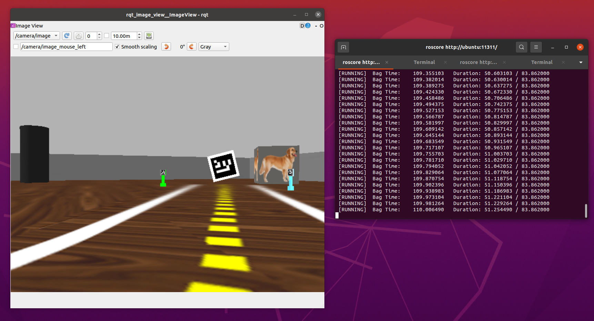
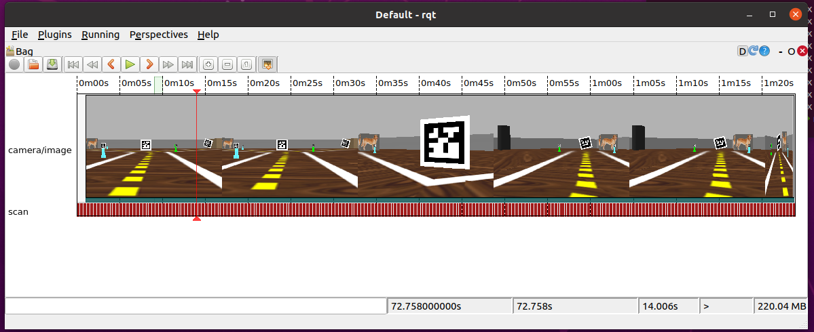

# Rosbag 

Em robótica é muito comum trabalhar com arquivos de *replay* de inputs sensoriais.

Tipicamente é usado para que seja possível desenvolver um algoritmo com modificações frequentes do programa.

Fontes:

[ROS Robot Programming seção 5.4.8](https://www.robotis.com/service/download.php?no=719)
[Tutorial oficial na Wiki ROS http://wiki.ros.org/rosbag](http://wiki.ros.org/rosbag)


## Para gravar um sensor específico 

Por exemplo, para gravar o input de câmera do Turtlebot dentro do Gazebo

    rosbag record /camera/image  /scan

O ROS vai gravar um arquivo que termina com a extensão *bag* e cujo nome é baseado na data atual. Exemplo: `2021-05-13-10-36-22.bag`.

Se você quiser especificar o nome do arquivo de saída, use a opção `-O nome_do_arquivo`. 

## Gravar os sensores

Para gravar o input de **todos os sensores** (Cuidado, o arquivo final será bem grande!): 

    rosbag record -a

## Consultar um bag file 

Para consultar o que de fato existe gravado no *bag file*, devemos usar o comando `rosbag info`: 

    rosbag info  2021-05-13-10-36-22.orig.bag

No caso o retorno mostra que estavam gravados dados da `/camera/image` e `/scan`:

```bash
11:15:27 mirwox@ubuntu ~ → rosbag info 2021-05-13-10-36-22.orig.bag
path:        2021-05-13-10-36-22.orig.bag
version:     2.0
duration:    1:23s (83s)
start:       Dec 31 1969 16:00:58.75 (58.75)
end:         Dec 31 1969 16:02:22.61 (142.61)
size:        1.9 GB
messages:    2655
compression: none [2235/2235 chunks]
types:       sensor_msgs/Image     [060021388200f6f0f447d0fcd9c64743]
             sensor_msgs/LaserScan [90c7ef2dc6895d81024acba2ac42f369]
topics:      /camera/image   2235 msgs    : sensor_msgs/Image
             /scan            420 msgs    : sensor_msgs/LaserScan
```


## Para fazer um replay e republicar os tópicos

Durante o replay **os tópicos são republicados**, como se houvesse um robô real ou simulação rodando.

Para fazer um replay precisamos ter um sistema *ROS* rodando: 

    roscore

E para fazer o *replay* de fato: 

    rosbag play 2021-05-13-10-36-22.bag 

**Atenção:** Troque o nome `2021-05-13-10-36-22.bag` pelo nome do seu arquivo *bag*. 

Durante o *replay*, os tópicos dos sensores recebem a informação que foi para o *bag file*.

Note que o `rqt_image_view` recebe as imagens como se o *Gazebo* estivesse rodando. 



## Comprimir e descomprimir 

    rosbag compress 021-05-13-10-36-22.bag

Depois de compactar, o arquivo antes de compactar aparecerá com `orig`  no nome.

    rosbag decompress 

## Ferramenta de visualizar - rqt bag

Rodar o comando: 

    rqt

No menu, selecionar *Plugins* - *Logging* - *Bag*.

Depois, no ícone que existe no canto superior esquerdo pode-se selecionar o qual rosbag visualizar




