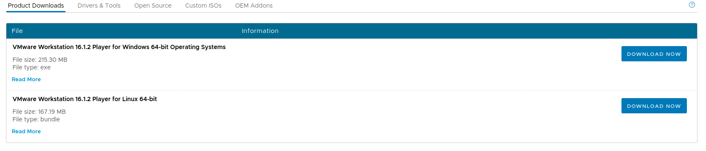
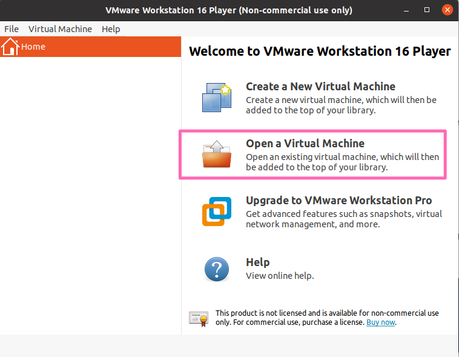
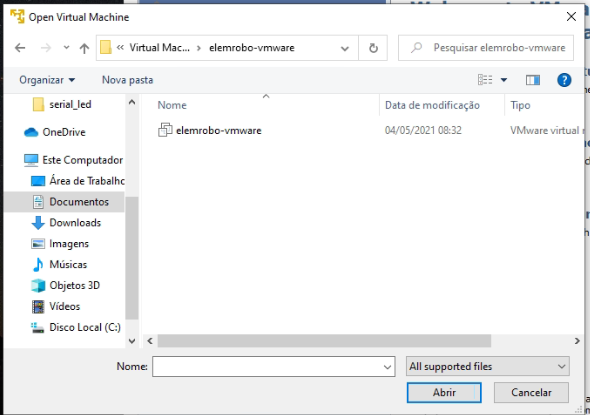
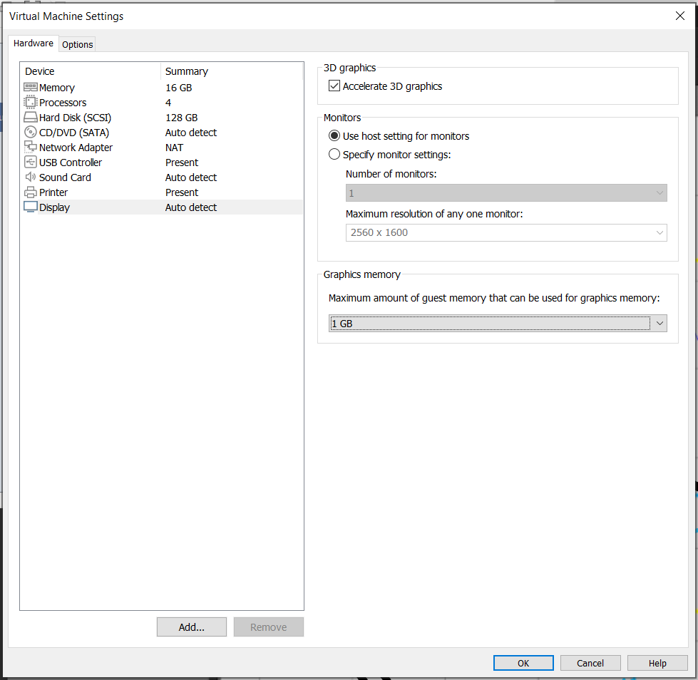
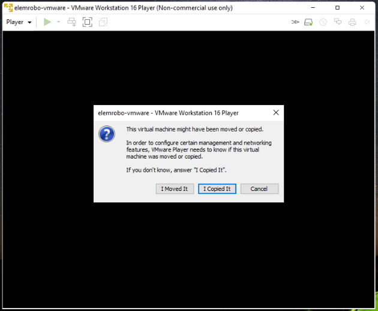
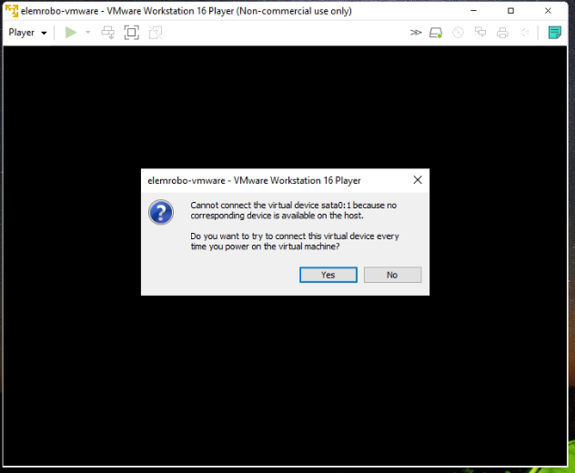
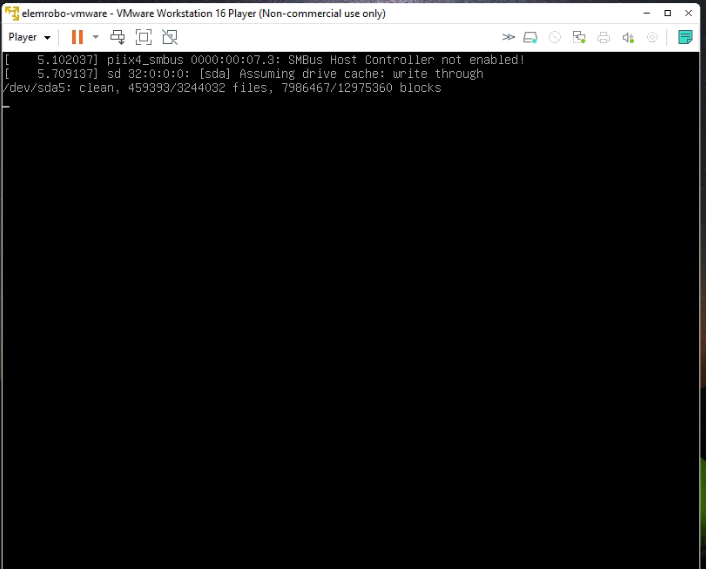
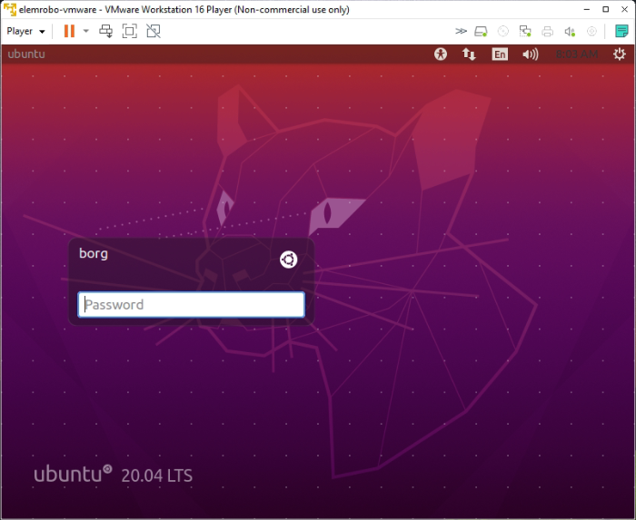
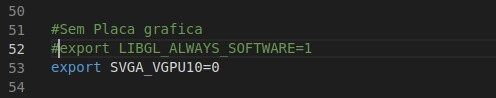

# Máquina Virtual via VMWARE

## Objetivo

Este guia auxilia quem quer utilizar a maquina virtual com a infra do terceiro semestre de engenharia de computação.

## VM elemrobo-vmware

Faça o download de todos os arquivos da pasta elemrobo-vmware através do link:
https://alinsperedu-my.sharepoint.com/:f:/g/personal/arnaldo_junior2_al_insper_edu_br/EqIQfJbhGoBMlx5Y46imm_QB9QsYAKPwjqd8j6sprRpRHg?e=iF7ktv

Obs: Para acesso, é necessário e login de aluno Insper.

Link alternativo: https://drive.google.com/drive/folders/1UURs1Hiw8DKKfGWgm3PFBufIF7KdbF8X?usp=sharing

Esse processo pode demorar, ao todo os arquivos tem o tamanho aproximado de 34GB. Por isso, verifique se possui espaço suficiente em seu disco rigido, como sugestão tenha o equivalente a 50GB. 

## VMWARE Player

### Download
Vamos utilizar a VMWARE Player como maquina virtual. Faça o download através do link: 

https://my.vmware.com/en/web/vmware/downloads/details?downloadGroup=WKST-PLAYER-1612&productId=1039&rPId=66621

Faça o download do seu sistema operacional nativo.

### Instação

Faça a instalação do VMWARE. 

Para usuarios Windowns: Instalação normal clicando sobre o arquivo .exe

Para usuarios Linux:

    1. Troque as permissões do arquivo para torna-lo executavel, digiete no terminal: 

    '' sh
        chmod a+x VMware*
    ''
    2. Execute o arquivo como root, digite no terminal:

    '' sh
        sudo ./VMware8
    ''

## Importando a VM

Com tudo baixado instalado. 

Execute o WMware Player, clique na opção ***Open a Virtual Machine**.

Acesse a pasta onde esta salvo o download da maquina virtual e selecione o arquivo ***elemrobo-vmware***

Com a VM importada, entre editar configurações clicando com o botão direto em ***elemrobo-vmware*** selecione settings. Configure conforme a imagem  

Clique em **Play** para inicializar. 

Algumas mensagens de alerta irão aparecer. 

Selecione a opção **I Copied It**. 

Selecione a opção **No**. 

Se tudo ocorrer bem, sua maquina virtual irá começar a inicializar.

Após alguns instante a tela de login irá aparecer. A senha é **fl1pfl0p**

Com a VM inicializada, faça o ultimo ajuste. Abra o terminal e edite o arquivo **robotica.sh**

    code robotica.sh

Comente a linha 52 que diz: LIBGL_ALWAYS_SOFTWARE=1 e adicione:

    export SVGA_VGPU10=0

Fim.
